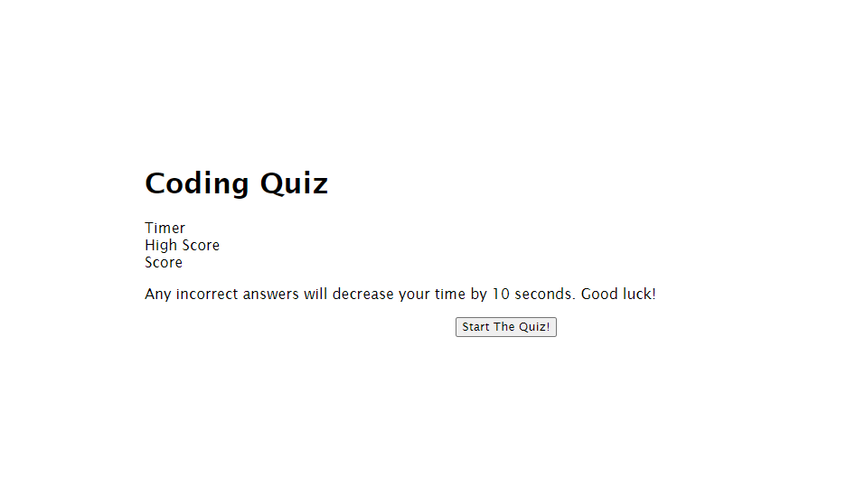
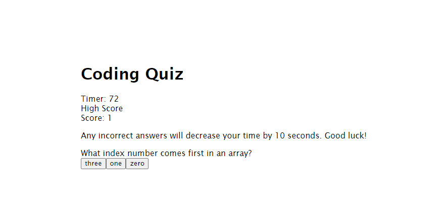

# Javascript-Coding-Quiz
Coding Quiz Assignment

This is a basic coding quiz, designed to test your knowledge of Javascript at the beginning stages.

You will be prompted to answer five questions within 80 seconds. Choose the correct answer to gain a point. Choose incorrectly, additional seconds will be subtracted from your remaining time.

At the end of the quiz, enter your initials where prompted, and your final score will be saved.

https://tkshadowblade.github.io/Javascript-Coding-Quiz/

